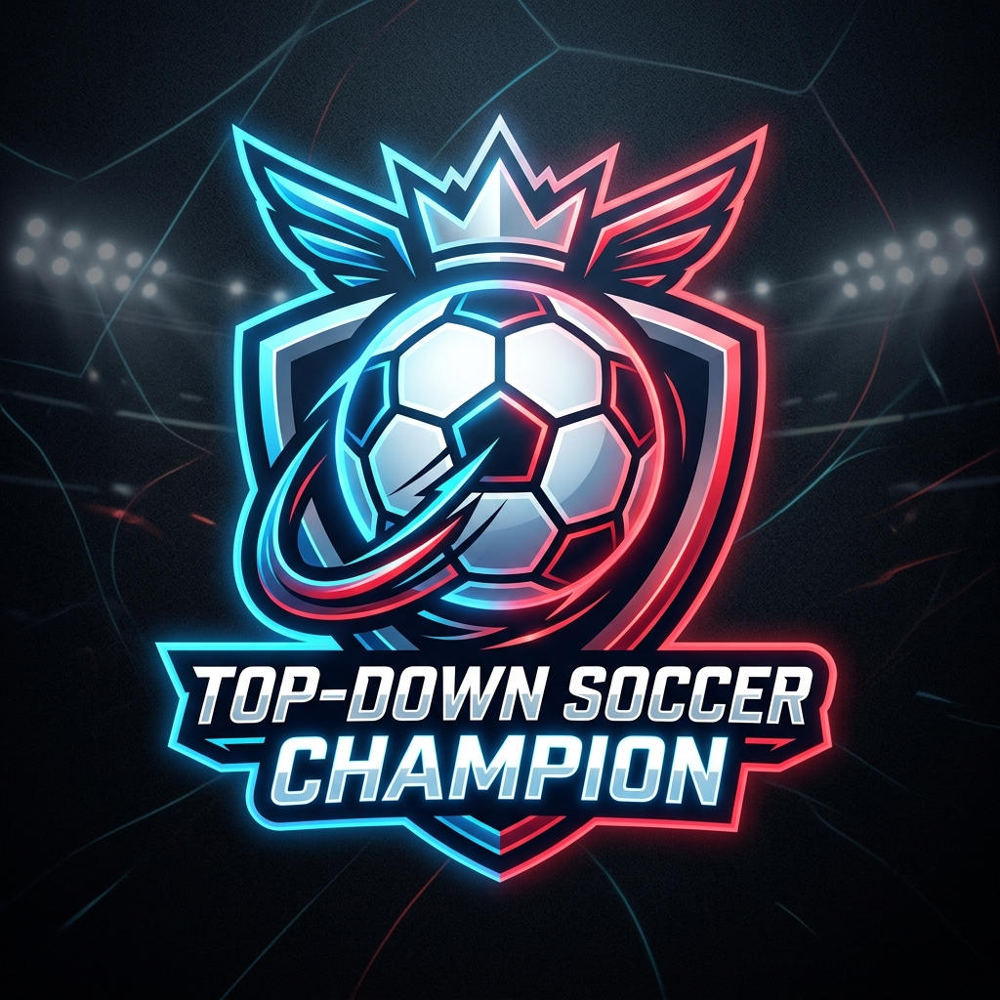
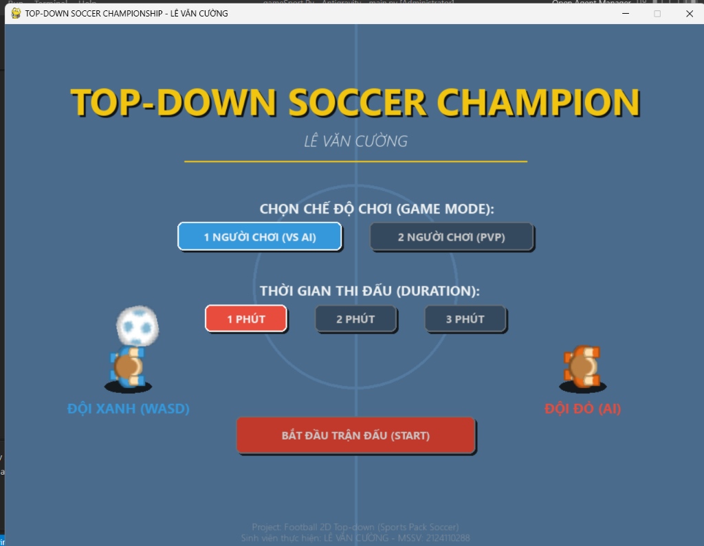

# <p align="center"></p>

## ĐỀ TÀI: NGHIÊN CỨU VÀ XÂY DỰNG TRÒ CHƠI BÓNG ĐÁ 2D TOP-DOWN SỬ DỤNG THƯ VIỆN PYGAME

* **Sinh viên thực hiện:** LÊ VĂN CƯỜNG
* **Mã số sinh viên (MSSV):** 2124110288



## 1. GIỚI THIỆU ĐỀ TÀI & MỤC TIÊU NGHIÊN CỨU
Project này tập trung vào việc thiết kế và phát triển một trò chơi bóng đá góc nhìn từ trên xuống (Top-down) mang tên **Top-Down Soccer Champion**. Dự án sử dụng ngôn ngữ lập trình **Python** kết hợp với thư viện đồ họa **Pygame**, tận dụng tài nguyên hình ảnh nguồn mở chất lượng cao từ gói **Kenney Sports Pack**.

### Mục tiêu đề tài:
1. Áp dụng kiến thức lập trình hướng đối tượng (OOP) vào thực tế phát triển game.
2. Thiết kế hệ thống quản lý trạng thái (State Pattern) giúp phân tách rõ ràng giao diện Menu, Trận đấu và Kết quả.
3. Mô phỏng vật lý bóng đá 2D cơ bản bao gồm: lực ma sát sân cỏ, lực sút của cầu thủ, va chạm biên sân, va chạm đàn hồi cột gôn và va chạm đẩy người giữa các cầu thủ.
4. Xây dựng trí tuệ nhân tạo (AI) đơn giản cho đồng đội và đối thủ dựa trên máy trạng thái và thuật toán bám sát hành vi theo vai trò (Thủ môn, Hậu vệ, Tiền đạo).
5. Tích hợp tổ trọng tài chính và trọng tài biên sống động để điều hành trận đấu chuyên nghiệp.

---

## 2. CẤU TRÚC THƯ MỤC DỰ ÁN (PROJECT STRUCTURE)
Dự án tuân thủ nghiêm ngặt nguyên tắc lập trình module sạch sẽ, không gộp chung toàn bộ mã nguồn vào một tệp duy nhất, giúp hệ thống dễ dàng bảo trì và mở rộng:

```text
gameSport Py/
│
├── main.py                  # Điểm khởi chạy chương trình (Main Entry Point)
├── config.py                # Khai báo các hằng số, kích thước, màu sắc và phím điều khiển
├── requirements.txt         # Khai báo các thư viện phụ thuộc (Pygame)
├── README.md                # Báo cáo thuyết minh
│
├── kenney_sports-pack/      # Thư mục chứa tài nguyên hình ảnh từ gói Kenney Sports Pack
│   └── PNG/
│       ├── Blue/            # Sprite cầu thủ đội Xanh (1 - 14)
│       ├── Red/             # Sprite cầu thủ đội Đỏ (1 - 14)
│       ├── Equipment/       # Ảnh thiết bị (bóng đá, thẻ phạt...)
│       └── Elements/        # Các phần tử đồ họa phụ trợ
│
├── utils/                   # Các module tiện ích hệ thống
│   ├── __init__.py
│   └── asset_loader.py      # Tải tài nguyên hình ảnh & cung cấp cơ chế vẽ dự phòng (fallback)
│
├── sprites/                 # Định nghĩa các đối tượng (Entities) trong trò chơi
│   ├── __init__.py
│   ├── ball.py              # Xử lý vật lý và va chạm quả bóng
│   ├── player.py            # Lớp cầu thủ cơ sở (di chuyển, rê bóng, sút gôn)
│   ├── player_user.py       # Cầu thủ do người chơi điều khiển từ bàn phím
│   ├── player_ai.py         # Cầu thủ tự động do AI điều khiển (Goalkeeper, Defender, Striker)
│   └── referee.py           # Quản lý lớp Trọng tài chính (Referee) và Trọng tài biên (Linesman)
│
└── states/                  # Quản lý luồng màn hình trò chơi (State Pattern)
    ├── __init__.py
    ├── state_manager.py     # Bộ điều phối chuyển cảnh
    ├── menu_state.py        # Màn hình Menu chính & tùy chọn cấu hình
    ├── playing_state.py     # Quản lý trận đấu và tính điểm thi đấu
    └── game_over_state.py   # Màn hình kết quả & bảng thống kê kỹ thuật trận đấu
```

---

## 3. LUẬT CHƠI & CƠ CHẾ GAMEPLAY
* **Quy mô trận đấu:** Thi đấu theo thể thức **3v3** (3 cầu thủ đội Xanh chống lại 3 cầu thủ đội Đỏ). Mỗi đội gồm có: 1 Thủ môn (AI), 1 Hậu vệ (AI) và 1 Tiền đạo (Người chơi hoặc AI tùy thuộc chế độ chơi).
* **Mục tiêu:** Đưa bóng vào khung thành đối phương nhiều hơn đối thủ trong khoảng thời gian quy định để giành chiến thắng.
* **Thời gian thi đấu:** Người chơi có thể tùy chọn thời gian trận đấu là **1 phút**, **2 phút** hoặc **3 phút** tại màn hình Menu chính.
* **Cơ chế ghi bàn (Goal):** Quả bóng phải đi qua hoàn toàn vạch gôn và đi vào lưới phía sau. Sau mỗi bàn thắng, trò chơi sẽ chạy hiệu ứng ăn mừng nhấp nháy chữ **GOAL!** hoành tráng, cộng điểm cho đội ghi bàn và tự động thiết lập lại vị trí các cầu thủ về điểm phát bóng ban đầu (Kickoff).
* **Hệ thống khống chế "Dính bóng" (Sticky Dribble):** Khắc phục hoàn toàn hiện tượng bóng bị trôi khi đổi hướng. Khi tiếp cận bóng, bóng sẽ được khóa chặt vào chân cầu thủ đang dẫn dắt. Bóng chỉ rời chân khi thực hiện hành động Sút (Kick), Chuyền (Pass) hoặc bị cầu thủ đối phương áp sát cướp bóng cận chiến.
* **Luật bóng ra ngoài đường biên (Out of Bounds Rules):**
  * **Ném biên (Touchline):** Khi bóng bay ra ngoài đường biên dọc (trên/dưới), trận đấu tạm dừng với dòng chữ thông báo **"NÉM BIÊN!"**. Cầu thủ gần nhất của đội được hưởng quyền ném biên sẽ nhận bóng để tiếp tục rê hoặc chuyền vào sân.
  * **Phát bóng lên (Goal Kick):** Khi đội tấn công làm bóng bay hết đường biên ngang bên ngoài khung thành, thủ môn đội phòng ngự sẽ nhận bóng tại vòng cấm địa để phát bóng lên.
  * **Phạt góc (Corner Kick):** Khi đội phòng ngự làm bóng bay hết đường biên ngang bên ngoài khung thành, cầu thủ đội tấn công sẽ nhận bóng tại chấm phạt góc để treo bóng vào trong.
* **Tổ trọng tài điều hành:** Trọng tài chính di chuyển bám sát bóng trên sân (tự động giữ khoảng cách lịch sự với bóng và rẽ hướng tránh né va chạm với các cầu thủ). Hai trọng tài biên di chuyển dọc theo hai đường biên ngang của bóng ở ngoài sân để giám sát trận đấu.

---

## 4. HƯỚNG DẪN ĐIỀU KHIỂN (CONTROLS BINDING)

### Chế độ 1 Người chơi (VS AI):
* **Người chơi 1 (Đội Xanh - Blue Team):**
  * Di chuyển: các phím **MŨI TÊN (UP, DOWN, LEFT, RIGHT)**
  * Sút bóng / Tắc bóng cướp bóng: phím **D**
  * Chuyền bóng cho đồng đội: phím **S**
  * *Vòng tròn chỉ thị hướng dưới chân giúp xác định góc chuyền bóng dễ dàng.*
* **Đội Đỏ (Red Team):** Do máy tính (AI) điều khiển tự động hoàn toàn.

### Chế độ 2 Người chơi (Local PvP):
* **Người chơi 1 (Đội Xanh - Blue Team):**
  * Di chuyển: các phím **MŨI TÊN (UP, DOWN, LEFT, RIGHT)**
  * Sút bóng / Tắc bóng: phím **D**
  * Chuyền bóng: phím **S**
* **Người chơi 2 (Đội Đỏ - Red Team):**
  * Di chuyển: các phím **W, A, S, D**
  * Sút bóng / Tắc bóng: phím **J**
  * Chuyền bóng: phím **K**

### Phím chung hệ thống:
* Thoát nhanh trận đấu về Menu chính: phím **ESC**

---

## 5. CÔNG NGHỆ VÀ THƯ VIỆN SỬ DỤNG
* **Ngôn ngữ phát triển:** Python 3.8+
* **Thư viện chính:** Pygame (thư viện đồ họa, quản lý sự kiện và âm thanh).
* **Đồ họa:** Kenney Sports Pack (định dạng PNG 2D phẳng hiện đại).

---

## 6. CÁC TÍNH NĂNG KỸ THUẬT NỔI BẬT (SOURCE CODE HIGHLIGHTS)
1. **Cơ chế nạp tài nguyên dự phòng (Fallback Graphics System):**
   Nếu người dùng quên hoặc thiếu thư mục ảnh `kenney_sports-pack`, hệ thống của `utils/asset_loader.py` sẽ tự động phát hiện lỗi và tự vẽ các mô hình vector cầu thủ (hình tròn có mũi tên hướng) và bóng tròn để game tiếp tục hoạt động bình thường mà không bị crash hệ thống.
2. **Trí tuệ nhân tạo (AI Machine Logic):**
   * **Thủ môn:** Tự động di chuyển dọc theo trục gôn để cản phá đường bóng của đối thủ, nếu bóng đi vào vòng cấm, thủ môn sẽ tự động lao ra phá bóng giải nguy.
   * **Hậu vệ:** Luôn chọn vị trí đứng chặn giữa quả bóng và gôn nhà để bọc lót.
   * **Tiền đạo:** Tự động đuổi theo bóng, rê bóng và thực hiện sút gôn chéo góc khi ở cự ly gần.
3. **Thống kê kỹ thuật cuối trận đấu:**
   Game tự động ghi nhận số cú sút gôn thành công, tỷ lệ kiểm soát bóng của từng đội dựa trên số frames khống chế bóng thực tế và hiển thị trực quan dưới dạng bảng điểm cuối trận giống như các trận đấu thể thao chuyên nghiệp.

---

## 7. HƯỚNG DẪN CÀI ĐẶT & CHẠY CHƯƠNG TRÌNH

### Bước 1: Yêu cầu chuẩn bị
Đảm bảo máy tính của bạn đã cài đặt Python (phiên bản 3.8 trở lên).

### Bước 2: Cài đặt thư viện phụ thuộc
Mở terminal hoặc cửa sổ dòng lệnh (PowerShell/CMD) tại thư mục dự án và chạy lệnh sau để cài đặt Pygame:
```bash
pip install -r requirements.txt
```

### Bước 3: Khởi chạy trò chơi
Sau khi cài đặt thành công, khởi chạy trò chơi bằng lệnh:
```bash
python main.py
```

---

## 8. KẾT LUẬN & HƯỚNG PHÁT TRIỂN
Project này đã xây dựng thành công một trò chơi bóng đá 2D Top-down hoàn chỉnh, đáp ứng đầy đủ các tiêu chuẩn của một môn học: cấu trúc mã nguồn sạch sẽ, thuật toán xử lý vật lý trực quan và cơ chế AI thông minh tương đối ổn định.

**Hướng phát triển tiếp theo:**
* Phát triển thêm âm thanh cổ vũ khán giả sống động và âm sút bóng.
* Bổ sung tính năng thổi phạt lỗi (Foul) và phạt thẻ vàng, thẻ đỏ khi các cầu thủ tranh chấp quá quyết liệt.
* Xây dựng chế độ chơi mạng trực tuyến (Multiplayer Co-op) qua mạng LAN.
